## 📖 프로젝트 소개

> 일상 속에서 천천히 스며드는 물건들 사용한 사람들의 진짜 이야기들을 담았습니다.
> 일상을 책임 지진 않지만 함께 곁에서 은은하게 일상을 채워주는 것들이 있습니다.
>  
> 때로는 정말 하찮거나 잡스럽다고 느낄 수 있겠지만 모두 하나하나의 이야기를 가지고 있습니다.
>   
> `ObeStore` 는 그 이야기가 만들어지고 전해지는 공간입니다. 
>  
> 오늘은 어떤 이야기가 쓰여질까요? 이미 당신 또한 그 이야기를 가지고 있습니다.
---
## :link: 배포 링크

> ### [⛪ 배포 링크](https://obe-store.vercel.app/)

---
## 🗣️ 프로젝트 발표 영상 & 발표 문서

> ### 🗓️ 2025.10-.26 - 2025.11.19
> ### [📺 발표 영상](https://youtu.be/dX8uJDJZ2DE)

---

## 🖥️ 서비스 소개
|   메인 화면 1  |  메인 화면 2  |   상품 페이지   |
|:--------:|:------:|:--------:|
| 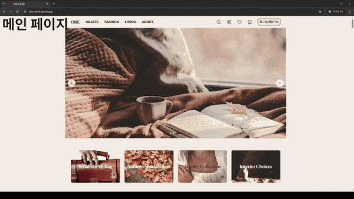 |   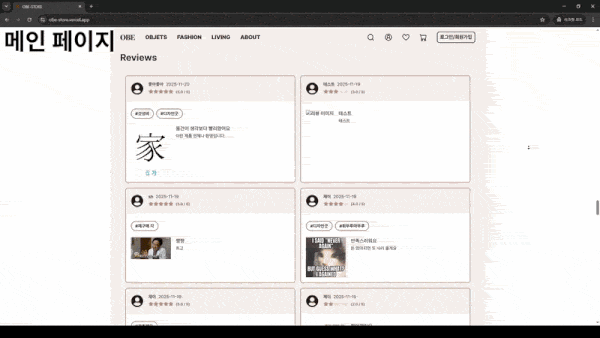  | 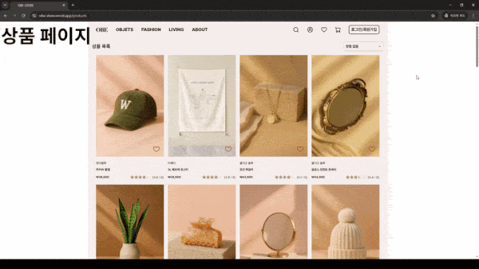 |

|                                                                                                          필터링                                                                                                           |                                                                                                              카테고리                                                                                                               |                                                                                                             어바웃 페이지                                                                                                             |
|:---------------------------------------------------------------------------------------------------------------------------------------------------------------------------------------------------------------------------:|:--------------------------------------------------------------------------------------------------------------------------------------------------------------------------------------------------------------------------------------:|:------------------------------------------------------------------------------------------------------------------------------------------------------------------------------------------------------------------------------:|
|  | 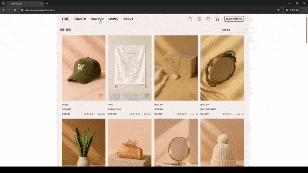 | 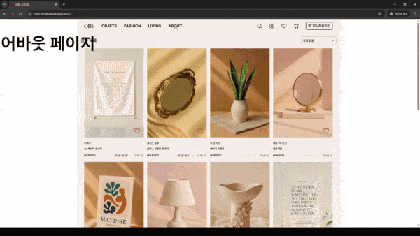 |

|                                                                                                             회원가입                                                                                                             |      이메일 인증      |      로그인    |
|:-----------------------------------------------------------------------------------------------------------------------------------------------------------------------------------------------------------------------------------:|:-------:|:---------:|
| 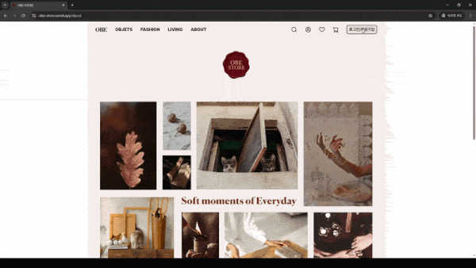 | 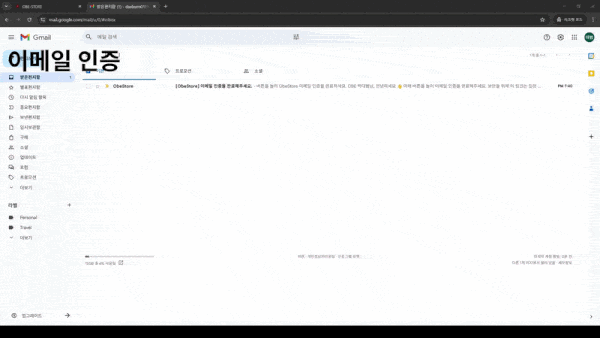 | 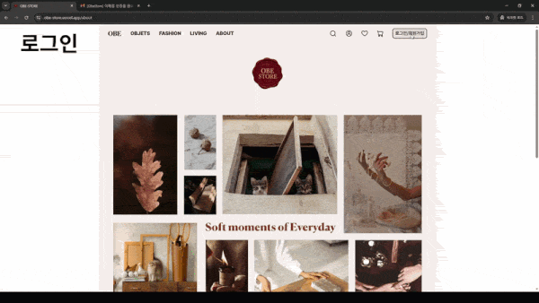 |

|                                                                                                             찜 기능                                                                                                             |              검색 기능              |              상품 상세              |
|:---------------------------------------------------------------------------------------------------------------------------------------------------------------------------------------------------------------------------------:|:--------------------------------:|:--------------------------------:|
| 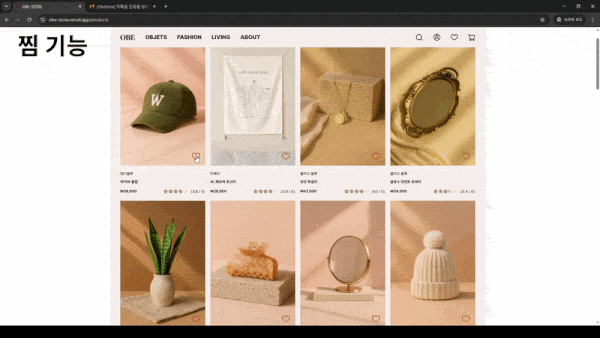  | 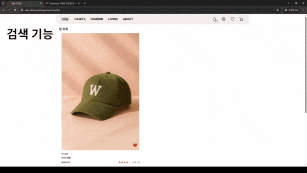 | 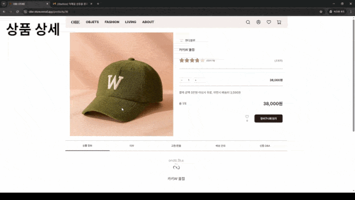 |

|                                                                                                               카트                                                                                                                |              주문              |            결제             |
|:-----------------------------------------------------------------------------------------------------------------------------------------------------------------------------------------------------------------------------------:|:--------------------------------:|:-------------------------------:|
| 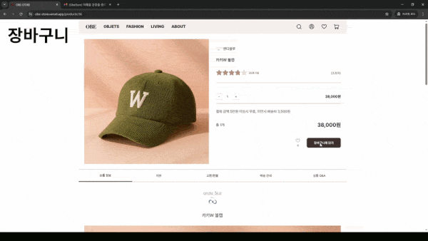 | 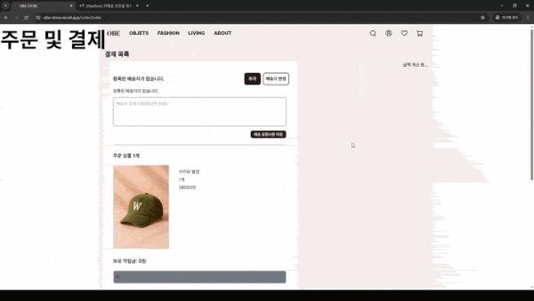 | 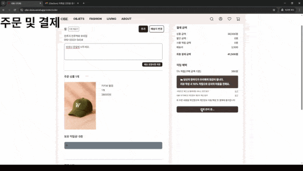 |

|                                                                                                          리뷰 기능                                                                                                           |             소셜 로그인             |           수정 및 회원탈퇴           |
|:--------------------------------------------------------------------------------------------------------------------------------------------------------------------------------------------------------------------------------:|:----------:|:--------------------------:|
| 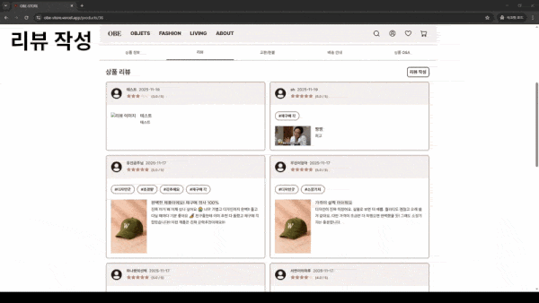 |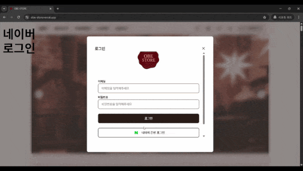 | 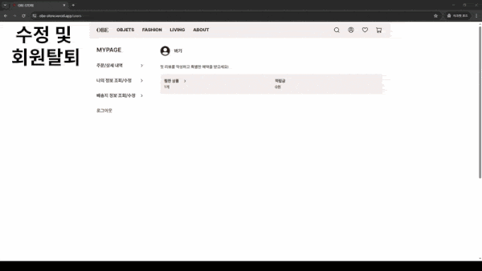 |
---

## 🧰 사용 스택

### :wrench: System Architecture

### FE

   
   
   
   

   
  
  
   

  
  
  
  
  
   

### BE

 
  
   
  
  
   

  
  
   
  
   

### Deploy

 
  
   
  
  
   

  
  
   
  
  
   

--- 

## :busts_in_silhouette: 팀 동료

### FE

| <a href=https://github.com/> <b>@Jay-klmnop</b></a>  | <a href=https://github.com/> <b>@KoCeleste</b></a>  | <a href=https://github.com/> <b>@Joydazero</b></a>  |
|:--------------------------------------------------------------------------------------------------------------------------------------------------:|:--------------------------------------------------------------------------------------------------------------------------------------------------:|:--------------------------------------------------------------------------------------------------------------------------------------------------:|
|                                                                        윤지예                                                                         |                                                                        고연우                                                                         |                                                                        조다영                                                                         |

### BE

| <a href=https://github.com/kickcik/> <b>@kickcik</b></a>  | <a href=https://github.com/orioncsy> <b>@seokhun14</b></a>  | <a href=https://github.com/> <b>@daebagi</b></a>  | <a href=https://github.com/> <b>@grrr127</b></a>  | <a href=https://github.com/> <b>@Junhyeock</b></a>  |
|:----------------------------------------------------------------------------------------------------------------------------------------------:|:----------------------------------------------------------------------------------------------------------------------------------------------------------:|:--------------------------------------------------------------------------------------------------------------------------------------:|:--------------------------------------------------------------------------------------------------------------------------------------:|:----------------------------------------------------------------------------------------------------------------------------------------:|
|                                                                      강인찬                                                                       |                                                                            김석훈                                                                             |                                                                  박대범                                                                   |                                                                  방그리                                                                   |                                                                   이준혁                                                                    |      

## 📑 프로젝트 규칙

### Branch Strategy
> - main / develop 브랜치 기본 생성 
> - main으로 직접 push 제한
> - PR 전 최소 1인 이상 승인 필수

### Git Convention
> 1. 적절한 커밋 접두사 작성
> 2. 커밋 메시지 내용 작성

> | 접두사        | 설명                           |
> | ------------- | ------------------------------ |
> | Feat :     | 새로운 기능 구현               |
> | Add :      | 에셋 파일 추가                 |
> | Fix :      | 버그 수정                      |
> | Docs :     | 문서 추가 및 수정              |
> | Style :    | 스타일링 작업                  |
> | Refactor : | 코드 리팩토링 (동작 변경 없음) |
> | Test :     | 테스트                         |
> | Deploy :   | 배포                           |
> | Conf :     | 빌드, 환경 설정                |
> | Chore :    | 기타 작업                      |

### Pull Request
> ### Title
> * 제목은 '[Feat] 홈 페이지 구현'과 같이 작성합니다.

> ### PR Type
  > - [ ] FEAT: 새로운 기능 구현
  > - [ ] ADD : 에셋 파일 추가
  > - [ ] FIX: 버그 수정
  > - [ ] DOCS: 문서 추가 및 수정
  > - [ ] STYLE: 포맷팅 변경
  > - [ ] REFACTOR: 코드 리팩토링
  > - [ ] TEST: 테스트 관련
  > - [ ] DEPLOY: 배포 관련
  > - [ ] CONF: 빌드, 환경 설정
  > - [ ] CHORE: 기타 작업

> ### Description
> * 구체적인 작업 내용을 작성해주세요.
> * 이미지를 별도로 첨부하면 더 좋습니다 👍

> ### Discussion
> * 추후 논의할 점에 대해 작성해주세요.

### Code Convention
>BE
> - 패키지명 전체 소문자
> - 클래스명, 인터페이스명 CamelCase
> - 클래스 이름 명사 사용
> - 상수명 SNAKE_CASE

> FE
> - styled-Component 변수명 S + 변수명 (ex. Swrap)
> - styled-Component는 return문 위에 작성
> - 크게는 styled-Component, 그 안에서 className 사용 
> - Event handler 사용 (ex. handle ~)
> - export방식 (ex. export default ~)
> - 화살표 함수 사용

### Communication Rules
> - Discord 활용 
> - 아침 정기 회의

## :clipboard: Documents
> [📜 API 명세서](https://docs.google.com/spreadsheets/d/1GbKI0dNCaGEKf52aCUnzItHlG_JQlvnenDEx0ccjBf0/edit?gid=1843487763#gid=1843487763)
> 
> [📜 요구사항 정의서](https://docs.google.com/spreadsheets/d/1GbKI0dNCaGEKf52aCUnzItHlG_JQlvnenDEx0ccjBf0/edit?gid=428803499#gid=428803499)
> 
> [📜 ERD](https://www.erdcloud.com/d/niieZ9pJEKbhYgYGy)
> 
> [📜 테이블 명세서](https://docs.google.com/spreadsheets/d/1GbKI0dNCaGEKf52aCUnzItHlG_JQlvnenDEx0ccjBf0/edit?gid=1150019535#gid=1150019535)
>
> [📜 화면 정의서](https://docs.google.com/spreadsheets/d/1GbKI0dNCaGEKf52aCUnzItHlG_JQlvnenDEx0ccjBf0/edit?gid=1247178943#gid=1247178943)
